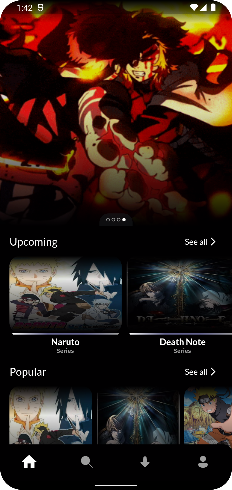
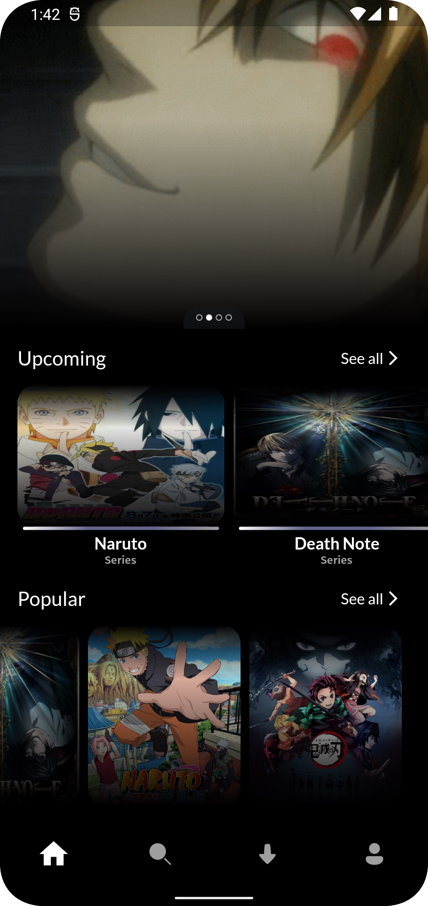
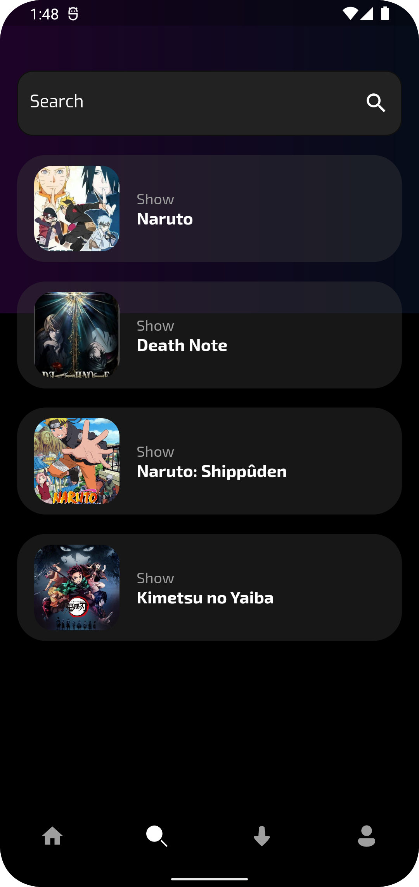
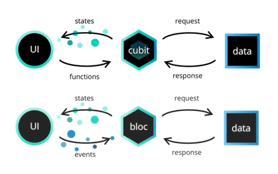

# Egymation 🎥
&middot; This application was developed using a well-defined and decoupled architecture, following TDD (test-driven programming) as a working methodology, Clean Architecture to make the distribution of responsibilities in layers, always following the SOLID principles and applying Design Patterns to solve some common problems. With the intention of practicing the teachings of the (Flutter, TDD, Clean Architecture, SOLID, Design Patterns).

## Clean Architecture

 - Presentation Layer
 - Domain Layer
 - Data Layer

## Screenshots

  
  
   
  

## State Management (BLoC & Cubit)

